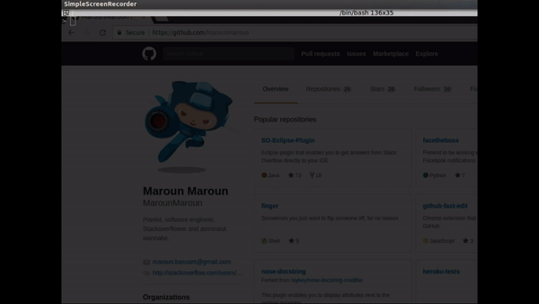

# youplay [](https://travis-ci.org/MarounMaroun/youplay)

Open YouTube videos from your shell.




## Installation

Clone repo and then `sudo python setup.py install`


## Running

```bash
youplay --play "beatles - yesterday"
```
